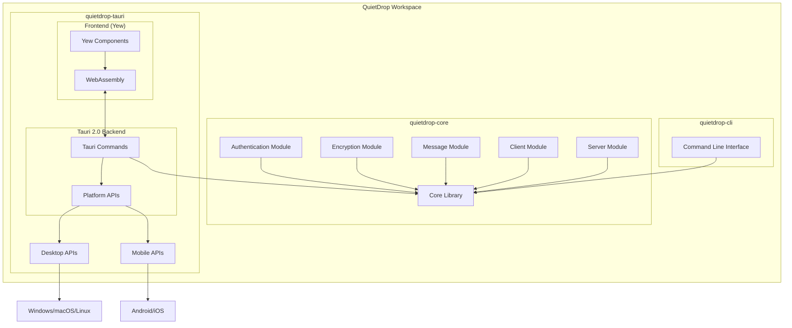

# QuietDrop Documentation

## Overview

QuietDrop is an end-to-end encrypted messaging application built in Rust. It prioritizes security, privacy, and performance while providing both command-line and cross-platform graphical user interfaces.

## Architecture

### Current Implementation

QuietDrop has been refactored to use a modular workspace architecture with Tauri 2.0 for cross-platform integration:



The system consists of the following components:

1. **Core Library** (`quietdrop-core`)
   - Contains all business logic and cryptographic operations
   - Provides a pure Rust API for other components
   - Maintains the original security and messaging functionality

2. **Command Line Interface** (`quietdrop-cli`)
   - Preserves the original CLI functionality
   - Provides server and client modes
   - Uses the core library for all operations

3. **Cross-Platform Application** (`quietdrop-tauri`)
   - **Frontend**: Built with Yew, a Rust framework that compiles to WebAssembly
   - **Backend**: Tauri 2.0 shell that bridges the frontend with core library
   - **Platform Support**: Unified codebase for desktop and mobile platforms
   - Provides a modern GUI while maintaining security

### Data Flow

1. **Key Exchange**:
   - Both server and client generate their key pairs (public and secret keys)
   - The server's public key is stored and shared with clients
   - Each client generates its own key pair and sends its public key with each message

2. **Message Encryption**:
   - Messages are encrypted on the client side using the server's public key and client's secret key
   - The encrypted message is sent along with the client's public key

3. **Message Decryption**:
   - The server decrypts messages using the client's public key and its own secret key

4. **Cross-Platform UI Flow**:
   - User input is captured in the Yew frontend
   - Actions are sent to the Tauri backend via commands
   - Tauri backend uses the core library to perform operations
   - Results are returned to the frontend for display
   - Platform-specific APIs are used when needed (mobile vs desktop)

## Security Features

### End-to-End Encryption

QuietDrop uses the NaCl cryptographic library (via sodiumoxide) to implement public-key authenticated encryption:

- **Algorithm**: X25519-XSalsa20-Poly1305 (crypto_box)
- **Key Exchange**: Currently manual exchange of public keys
- **Authentication**: Poly1305 message authentication code ensures message integrity

### Password Security

User passwords are secured using:

- **Hashing Algorithm**: Argon2id (memory-hard function)
- **Parameterization**: Configurable memory, iterations, and parallelism parameters
- **Salt**: Randomly generated and stored separately

### Platform Security

- **Desktop**: Process isolation, controlled API access, custom IPC protocol
- **Mobile**: Platform sandboxing, permission-based security model
- **Shared**: E2E encryption for all communications

## Core Components

### Authentication System

```rust
// Hash a password with Argon2id
pub fn hash_password(password: &str) -> Result<(String, String)>

// Verify a password against stored hash
pub fn verify_password(hashed_password: &str, salt: &str, password: &str) -> Result<bool>
```

### Encryption System

```rust
// Generate a new keypair
pub fn generate_keypair() -> KeyPair

// Encrypt a message using receiver's public key and sender's secret key
pub fn encrypt_message(message: &str, public_key: &PublicKey, secret_key: &SecretKey) -> Vec<u8>

// Decrypt a message using sender's public key and receiver's secret key
pub fn decrypt_message(encrypted_data: &[u8], public_key: &PublicKey, secret_key: &SecretKey) -> Result<String, &'static str>
```

### Message Format

Messages are structured as follows:

```rust
pub struct Message {
    pub timestamp: DateTime<Utc>,     // When the message was sent
    pub message_type: MessageType,    // Type of message (Text or File)
    pub sender: String,               // Sender's identifier
    pub recipient: String,            // Recipient's identifier
    pub content: Vec<u8>,             // Encrypted message content
    pub public_key: PublicKey,        // Sender's public key
}
```

## Setup and Usage

### Prerequisites

- Rust 1.70.0 or newer
- Cargo package manager
- System dependencies for Tauri (see [Tauri prerequisites](https://tauri.app/v1/guides/getting-started/prerequisites/))
- For mobile development, additional mobile SDK dependencies

### Building From Source

1. Clone the repository:
   ```bash
   git clone https://github.com/chizy7/QuietDrop.git
   cd QuietDrop
   ```

2. Build the core library and CLI:
   ```bash
   cargo build --workspace
   ```

3. Build the cross-platform application:

   **For Desktop:**
   ```bash
   cd quietdrop-tauri
   cargo tauri build
   ```

   **For Android:**
   ```bash
   cd quietdrop-tauri
   cargo tauri android build
   ```

   **For iOS:**
   ```bash
   cd quietdrop-tauri
   cargo tauri ios build
   ```

### Running the CLI

Run the server component:

```bash
cargo run -p quietdrop-cli -- server
```

This will:
- Generate a new server keypair if one doesn't exist
- Save the public and secret keys to `server_public_key.key` and `server_secret_key.key`
- Start listening for connections on `127.0.0.1:8080`

In a separate terminal, run the client:

```bash
cargo run -p quietdrop-cli -- client
```

### Running the Cross-Platform Application

For development:

```bash
# Desktop
cd quietdrop-tauri
cargo tauri dev

# Android
cd quietdrop-tauri
cargo tauri android dev

# iOS
cd quietdrop-tauri
cargo tauri ios dev
```

To run the built application:

```bash
# Desktop - After building
./target/release/quietdrop-tauri

# Mobile - Install the APK or app on your device
```

## Project Structure

The project is now organized as a Rust workspace with multiple crates:

```
quietdrop/
├── Cargo.toml                # Workspace manifest
├── quietdrop-core/           # Core library with shared functionality
│   ├── src/                  # Source files
│   │   ├── encryption.rs     # Encryption logic
│   │   ├── message.rs        # Message handling
│   │   ├── client.rs         # Client operations
│   │   ├── server.rs         # Server operations
│   │   ├── authentication.rs # Authentication
│   │   └── lib.rs            # Library exports
│   └── tests/                # Integration tests
├── quietdrop-cli/            # Command-line interface
│   ├── src/
│   │   └── main.rs           # CLI entry point
│   └── Cargo.toml
└── quietdrop-tauri/          # Tauri cross-platform application
    ├── Cargo.toml            # Frontend dependencies
    ├── index.html            # HTML entry point
    ├── styles.css            # CSS styles
    ├── src/                  # Yew frontend
    │   ├── main.rs           # Frontend entry point
    │   ├── components/       # UI components
    │   ├── services/         # Service interfaces
    │   └── models/           # Data models
    └── src-tauri/            # Tauri backend
        ├── src/
        │   └── main.rs       # Tauri command handlers
        ├── Cargo.toml
        └── tauri.conf.json   # Tauri configuration
```

## Development Workflow

### Workspace Development

- **Core Library**: Make changes to the core library to update functionality across all interfaces
- **CLI**: Update the command-line interface for terminal users
- **Tauri App**: Develop the cross-platform application with Yew and Tauri

### Running Tests

```bash
# Run all tests in the workspace
cargo test --workspace

# Run tests for a specific crate
cargo test -p quietdrop-core
```

### Frontend Development

The frontend is built with Yew, a Rust framework that compiles to WebAssembly:

1. Make changes to components in `quietdrop-tauri/src/`
2. Test responsiveness for both desktop and mobile interfaces
3. Use conditional rendering for platform-specific UI elements
4. Consider touch interfaces for mobile and pointer interfaces for desktop

### Backend Development

The Tauri backend connects the frontend to the core library:

1. Define command handlers in `quietdrop-tauri/src-tauri/src/main.rs`
2. Use conditional compilation for platform-specific features
3. Implement proper error handling and state management
4. Consider resource constraints on mobile devices

### Cross-Platform Considerations

- **UI Adaptation**: Adjust layouts for different screen sizes and input methods
- **Platform Detection**: Use Tauri's platform detection APIs
- **Resource Usage**: Be mindful of resource constraints on mobile devices
- **Permission Handling**: Implement proper permission requests for different platforms

## Contributing

We welcome contributions! Here's how to get started:

1. **Set Up Development Environment**:
   - Install Rust and Cargo
   - Install Tauri prerequisites
   - For mobile development, set up Android/iOS build environments

2. **Fork and Clone**: 
   - Fork the repository on GitHub
   - Clone your fork locally

3. **Branch and Develop**:
   - Create a branch for your feature
   - Make changes following our coding standards
   - Test on relevant platforms (desktop/mobile)

4. **Submit a PR**:
   - Open a pull request with your changes
   - Ensure CI checks pass
   - Provide testing information for platform-specific features

## Future Plans

- **SQLite Integration**: Add database persistence for messages and user data
- **Group Chat**: Implement secure group messaging
- **File Transfer**: Add encrypted file sharing capabilities
- **Push Notifications**: Implement secure push notifications for mobile
- **Offline Mode**: Enhance offline capabilities

## License

QuietDrop is licensed under the MIT License. See the [LICENSE](../LICENSE) file for details.