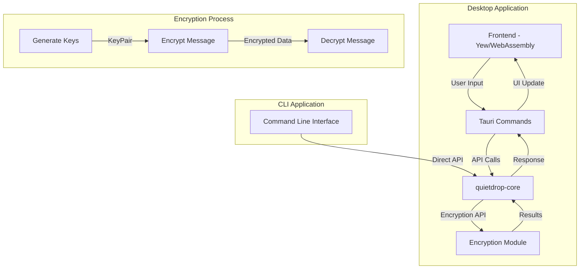
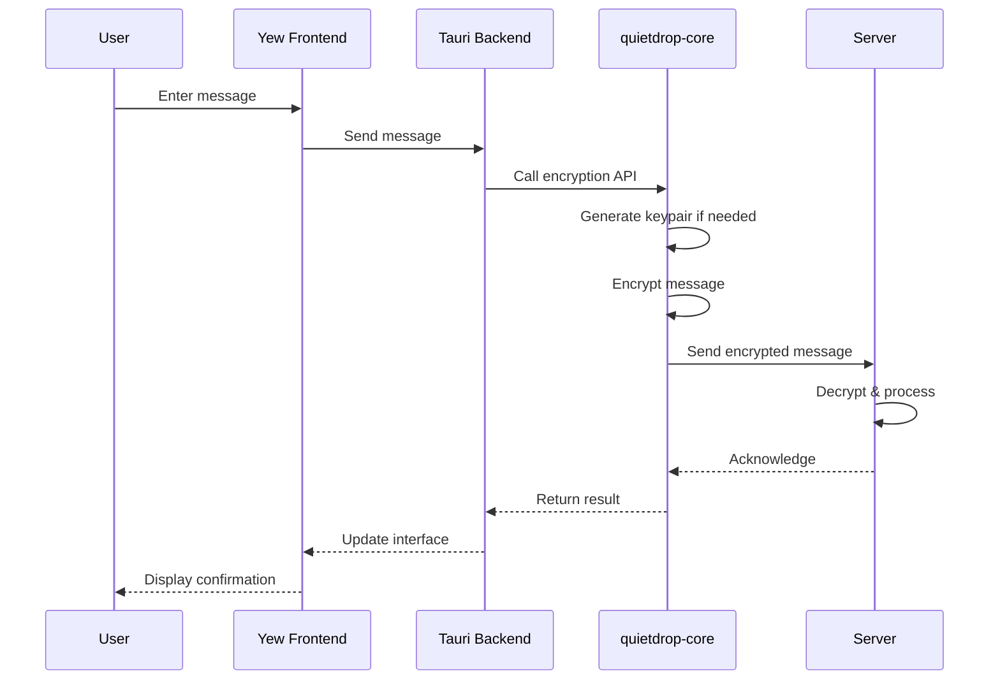

# QuietDrop Encryption Implementation

This document provides an in-depth explanation of the encryption mechanisms used in QuietDrop, intended for developers who want to understand or contribute to the security aspects of the project.

## Overview

QuietDrop uses public-key authenticated encryption to secure messages between users. The implementation is based on the NaCl cryptographic library (via the sodiumoxide Rust wrapper).

## Key Cryptographic Primitives

### Encryption Algorithm

QuietDrop uses `crypto_box` from NaCl, which implements:

- **X25519**: For elliptic curve Diffie-Hellman key exchange
- **XSalsa20**: Stream cipher for encryption
- **Poly1305**: Message authentication code

This combination (X25519-XSalsa20-Poly1305) provides the following security properties:

- **Confidentiality**: Messages cannot be read without the proper keys
- **Integrity**: Messages cannot be altered without detection
- **Authentication**: The sender's identity can be verified
- **Forward secrecy**: When implemented properly with rotating keys

### Key Pair Generation

```rust
pub fn generate_keypair() -> KeyPair {
    box_::gen_keypair()
}
```

This function creates a pair of:
- Public key (32 bytes) - Can be safely shared
- Secret key (32 bytes) - Must be kept private

### Message Encryption

```rust
pub fn encrypt_message(message: &str, public_key: &PublicKey, secret_key: &SecretKey) -> Vec<u8> {
    let nonce = box_::gen_nonce();
    let encrypted_msg = box_::seal(message.as_bytes(), &nonce, public_key, secret_key);

    [nonce.as_ref(), encrypted_msg.as_slice()].concat()
}
```

The encryption process:
1. Generates a random 24-byte nonce
2. Encrypts the message using the recipient's public key and sender's secret key
3. Prepends the nonce to the encrypted message to form the complete ciphertext

### Message Decryption

```rust
pub fn decrypt_message(
    encrypted_data: &[u8],
    public_key: &PublicKey,
    secret_key: &SecretKey,
) -> Result<String, &'static str> {
    if encrypted_data.len() < box_::NONCEBYTES {
        return Err("Encrypted data is too short");
    }

    let (nonce_bytes, encrypted_msg) = encrypted_data.split_at(box_::NONCEBYTES);
    let nonce = box_::Nonce::from_slice(nonce_bytes).ok_or("Failed to construct nonce")?;

    let decrypted_msg = box_::open(encrypted_msg, &nonce, public_key, secret_key)
        .map_err(|_| "Decryption failed")?;

    String::from_utf8(decrypted_msg).map_err(|_| "Invalid UTF-8")
}
```

The decryption process:
1. Splits the received data into nonce (first 24 bytes) and encrypted message
2. Reconstructs the nonce
3. Decrypts the message using the sender's public key and recipient's secret key
4. Converts the decrypted bytes to a UTF-8 string

## Implementation Flow in Tauri Architecture

The refactored architecture maintains the same encryption principles but integrates them with the Tauri desktop application:



### Key Storage in Tauri

In the Tauri application, keys are managed through:

1. **Memory Storage**: During application runtime, keys are stored in memory using Tauri's state management
2. **Secure Storage**: For persistence, keys are stored using Tauri's secure storage API, which leverages platform-specific mechanisms:
   - Windows: Windows Data Protection API
   - macOS: Keychain
   - Linux: libsecret

### Desktop App Encryption Flow



## Security Considerations

### Current Limitations

1. **Key Distribution**: The current implementation requires manual exchange of public keys
2. **Key Rotation**: There is no mechanism for periodic key rotation
3. **Perfect Forward Secrecy**: While the underlying crypto provides PFS capabilities, the current implementation doesn't fully utilize this
4. **Metadata Protection**: Message metadata (sender, recipient, timestamp) is not encrypted

### New Considerations with Tauri

1. **Frontend-Backend Boundary**: Messages crossing the WebAssembly boundary need protection
2. **Local Storage Security**: Keys stored on the local device require platform-specific security
3. **Application Updates**: Security of the update process for the desktop application

### Planned Improvements

1. **Double Ratchet Algorithm**: Implement the Signal Protocol's Double Ratchet for improved forward secrecy
2. **Key Management**: Create a secure and user-friendly key management system
3. **Metadata Protection**: Encrypt metadata to protect communication patterns
4. **Key Verification**: Add support for out-of-band key verification
5. **Secure Update Channel**: Implement signed updates for the desktop application

## Testing Encryption

For contributors wanting to test or extend the encryption functionality:

```rust
#[cfg(test)]
mod tests {
    use super::*;

    #[test]
    fn test_encryption_decryption() {
        // Generate key pairs for two parties
        let (alice_pk, alice_sk) = generate_keypair();
        let (bob_pk, bob_sk) = generate_keypair();

        // Original message
        let original_msg = "Hello, this is a secret message!";

        // Alice encrypts a message for Bob
        let encrypted = encrypt_message(original_msg, &bob_pk, &alice_sk);

        // Bob decrypts the message from Alice
        let decrypted = decrypt_message(&encrypted, &alice_pk, &bob_sk).unwrap();

        // Verify the message was correctly decrypted
        assert_eq!(original_msg, decrypted);
    }

    #[test]
    fn test_tampering_detection() {
        // Generate key pairs
        let (alice_pk, alice_sk) = generate_keypair();
        let (bob_pk, bob_sk) = generate_keypair();

        // Original message
        let original_msg = "Hello, this is a secret message!";

        // Alice encrypts a message for Bob
        let mut encrypted = encrypt_message(original_msg, &bob_pk, &alice_sk);

        // Tamper with the encrypted data
        if !encrypted.is_empty() {
            encrypted[encrypted.len() - 1] ^= 0x01;
        }

        // Bob tries to decrypt the tampered message
        let result = decrypt_message(&encrypted, &alice_pk, &bob_sk);
        
        // The decryption should fail
        assert!(result.is_err());
    }
}
```

## Testing Tauri Integration

```rust
// Example test for Tauri command that uses encryption
#[cfg(test)]
mod tests {
    use super::*;
    use tauri::State;

    #[test]
    fn test_send_message_command() {
        // Mock app state
        let app_state = AppState {
            keys: Mutex::new(Some((generate_keypair()))),
            // Other state...
        };

        // Create a test message
        let message_req = MessageRequest {
            content: "Test message".to_string(),
            recipient: "Test recipient".to_string(),
            // Other fields...
        };

        // Execute command in a runtime
        let rt = tokio::runtime::Runtime::new().unwrap();
        let result = rt.block_on(async {
            send_message(State::new(app_state), message_req).await
        });

        // Verify the result
        assert!(result.is_ok());
    }
}
```

## Best Practices for Contributors

When modifying the encryption code:

1. **Never Implement Custom Cryptography**: Rely on well-tested libraries
2. **Don't Reduce Security Parameters**: Maintain or improve security margins
3. **Always Add Tests**: Any change to cryptographic code must include tests
4. **Document Security Implications**: Comment on the security properties of your changes
5. **Consider Side-Channel Attacks**: Be mindful of timing attacks and other side channels
6. **Follow Memory Safety Practices**: Securely handle sensitive data in memory
7. **Respect the WebAssembly Boundary**: Be careful about what data crosses between the frontend and backend

## Glossary

- **Public-Key Cryptography**: Encryption system using key pairs (public and private)
- **Key Pair**: A set of mathematically related keys - one public, one secret
- **Nonce**: "Number used once" - a random value to ensure unique encryption results
- **Authentication**: Verifying the identity of the sender
- **Forward Secrecy**: Protection of past communications even if keys are compromised
- **WebAssembly**: Binary instruction format used for the frontend
- **Tauri**: Framework for building desktop applications with web technologies and Rust