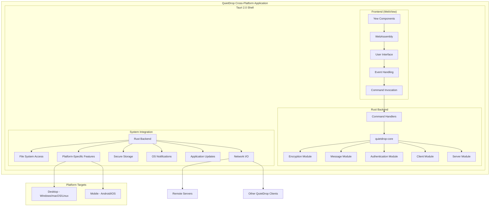
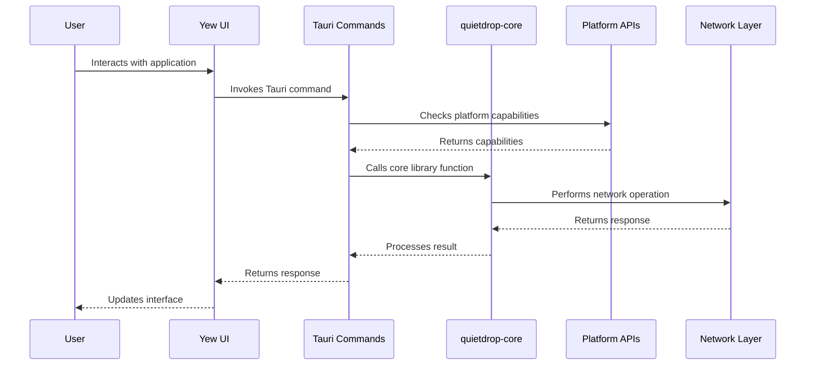

# QuietDrop Tauri 2.0 Architecture

This document explains the architecture of QuietDrop's cross-platform application built with Tauri 2.0, providing insights for developers who want to understand or contribute to this aspect of the project.

## Overview

QuietDrop's cross-platform application uses Tauri 2.0, a framework for building lightweight, secure applications for desktop and mobile platforms with web technologies and Rust. The application combines:

- **Rust Backend**: Core encryption and communication logic
- **Yew Frontend**: Rust-based UI framework that compiles to WebAssembly
- **Tauri 2.0 Shell**: Native application wrapper and system integration for both desktop and mobile

This architecture provides several advantages:
- **Unified Codebase**: Single codebase for desktop and mobile applications
- **Security**: Process isolation between frontend and backend
- **Performance**: Native performance with minimal resource overhead
- **Cross-platform**: Support for Windows, macOS, Linux, Android, and iOS
- **Type Safety**: Rust throughout the entire stack

## Architecture Diagram



## Key Components

### 1. Workspace Structure

The project uses a Cargo workspace with multiple crates:

| **Directory/File** | **Description** |
|----------------|-------------|
| `Cargo.toml` | Workspace manifest |
| `quietdrop-core/` | Core library with shared functionality |
| `quietdrop-cli/` | Command-line interface |
| `quietdrop-tauri/` | Tauri 2.0 cross-platform application |
| `quietdrop-tauri/src/` | Yew frontend |
| `quietdrop-tauri/src-tauri/` | Tauri backend |

### 2. Frontend Implementation (Yew)

The frontend is built using Yew, a Rust framework for creating web applications:

- **Component-Based**: Modular UI components in Rust
- **State Management**: Hooks and contexts manage application state
- **WebAssembly**: Compiled to WebAssembly for execution in WebView
- **Responsive Design**: UI adapts to different screen sizes and orientations
- **Platform Detection**: Conditional rendering based on platform

Key frontend files:
- `index.html`: HTML entry point
- `src/main.rs`: Application entry point
- `src/components/`: UI components
- `src/types/`: Shared type definitions
- `src/services/`: Service interfaces

Example responsive component structure:

```rust
#[function_component(ChatView)]
fn chat_view() -> Html {
    let messages = use_state(|| Vec::<Message>::new());
    let is_mobile = use_platform_detection();

    // Component logic

    html! {
        <div class={classes!("chat-container", if *is_mobile { "mobile" } else { "" })}>
            <MessageList messages={(*messages).clone()} />
            <MessageInput on_send={on_message_send} />
        </div>
    }
}
```

### 3. Tauri 2.0 Backend

The Tauri 2.0 backend bridges the frontend with the core library:

- **Command Handlers**: Expose core functionality to frontend
- **State Management**: Maintain application state
- **System Integration**: Access system resources
- **IPC**: Inter-Process Communication between frontend and backend
- **Platform APIs**: Unified API for platform-specific features

Key backend files:
- `src-tauri/src/main.rs`: Entry point for the backend
- `src-tauri/Cargo.toml`: Backend dependencies
- `src-tauri/tauri.conf.json`: Tauri configuration

Example command handler:

```rust
#[tauri::command]
async fn send_message(
    app_state: State<'_, AppState>,
    message_req: MessageRequest,
) -> Result<MessageResponse, String> {
    // Platform-specific checks
    #[cfg(mobile)]
    check_network_status()?;

    // Use quietdrop-core to send message
    // ...
}

fn main() {
    tauri::Builder::default()
        .manage(AppState { /* ... */ })
        .invoke_handler(tauri::generate_handler![
            send_message,
            get_messages,
            // Other commands
        ])
        .run(tauri::generate_context!())
        .expect("error while running tauri application");
}
```

### 4. Platform-Specific Features

Tauri 2.0 provides a unified API that abstracts platform differences:

**Desktop-Specific Features**:
- System tray integration
- Custom window decorations
- Multiple windows
- File system access with fewer restrictions

**Mobile-Specific Features**:
- Deep linking
- Push notifications
- Camera and photo library access
- Biometric authentication
- Background execution modes

**Implementation Example**:

```rust
// Platform detection in Rust backend
#[tauri::command]
fn get_platform_info() -> PlatformInfo {
    let info = PlatformInfo {
        #[cfg(target_os = "ios")]
        platform: "ios".to_string(),
        #[cfg(target_os = "android")]
        platform: "android".to_string(),
        #[cfg(desktop)]
        platform: "desktop".to_string(),
        // Other platform info
    };

    info
}

// Platform-specific plugin usage
#[cfg(mobile)]
fn setup_push_notifications(app: &mut App) {
    app.plugin(tauri_plugin_push_notifications::init())?;
}
```

### 5. Shared State and Storage

State is managed consistently across platforms:

1. **Core Application State**: Shared between desktop and mobile
   ```rust
   #[derive(Default)]
   struct AppState {
       keys: Mutex<Option<KeyPair>>,
       messages: Mutex<Vec<Message>>,
       // Common state
   }
   ```

2. **Platform-Specific State**: Conditionally compiled
   ```rust
   #[cfg(desktop)]
   struct DesktopState {
       tray_handle: Mutex<Option<SystemTrayHandle>>,
       // Desktop-specific state
   }

   #[cfg(mobile)]
   struct MobileState {
       push_token: Mutex<Option<String>>,
       // Mobile-specific state
   }
   ```

3. **Storage Strategies**:
   - **Desktop**: File system with fewer restrictions
   - **Mobile**: Sandbox-compliant storage with platform-specific limitations
   - **Shared**: SQLite database using the same schema on all platforms

### 6. Communication Flow



## Development Workflow

### Setting Up the Development Environment

1. Install prerequisites:
   ```bash
   # Install Rust
   curl --proto '=https' --tlsv1.2 -sSf https://sh.rustup.rs | sh

   # Install Trunk (for Yew)
   cargo install trunk

   # Install WebAssembly target
   rustup target add wasm32-unknown-unknown

   # Install Tauri CLI
   cargo install tauri-cli

   # For Android development
   # Install Android SDK, NDK, and other dependencies

   # For iOS development
   # Install Xcode and iOS build tools
   ```

2. Run in development mode:
   ```bash
   # For desktop
   cd quietdrop-tauri
   cargo tauri dev

   # For Android
   cd quietdrop-tauri
   cargo tauri android dev

   # For iOS
   cd quietdrop-tauri
   cargo tauri ios dev
   ```

### Building for Production

```bash
# Build for desktop platforms
cd quietdrop-tauri
cargo tauri build

# Build for Android
cd quietdrop-tauri
cargo tauri android build

# Build for iOS
cd quietdrop-tauri
cargo tauri ios build
```

## Cross-Platform Considerations

### 1. Responsive UI Design

- Use responsive CSS with media queries
- Implement alternative layouts for mobile vs. desktop
- Consider touch targets for mobile interfaces
- Handle different screen orientations

### 2. Platform Detection

```rust
// In Yew frontend
fn use_platform_detection() -> bool {
    let window = web_sys::window().unwrap();
    let navigator = window.navigator();
    let user_agent = navigator.user_agent().unwrap();

    user_agent.contains("Android") || user_agent.contains("iPhone")
}

// In Tauri backend
#[tauri::command]
fn get_platform() -> String {
    #[cfg(target_os = "android")]
    return "android".to_string();

    #[cfg(target_os = "ios")]
    return "ios".to_string();

    #[cfg(desktop)]
    return "desktop".to_string();
}
```

### 3. Performance Optimization

- Reduce WebView memory usage for mobile
- Optimize bundle size for faster loading
- Use efficient rendering techniques
- Implement virtualized lists for large datasets

### 4. Platform Capabilities Management

```rust
// Check if a feature is available before using it
#[tauri::command]
async fn use_feature(app_handle: AppHandle) -> Result<(), String> {
    #[cfg(desktop)]
    {
        // Desktop-specific implementation
        return Ok(());
    }

    #[cfg(target_os = "android")]
    {
        // Android-specific implementation
        return Ok(());
    }

    #[cfg(target_os = "ios")]
    {
        // iOS-specific implementation
        return Ok(());
    }

    Err("Feature not available on this platform".to_string())
}
```

## Security Considerations

Tauri 2.0's security model applies to both desktop and mobile:

1. **Process Isolation**: The frontend (WebView) and backend (Rust) run in separate processes
2. **Controlled API Access**: The frontend can only access what's explicitly exposed
3. **Custom Protocol**: Communication uses a custom IPC protocol
4. **CSP Enforcement**: Content Security Policy protects against web attacks
5. **Resource Control**: Access to system resources is controlled and limited
6. **Mobile Sandboxing**: Leverages platform-specific security models on mobile

## Future Architectural Improvements

1. **Offline-First Architecture**: Improve offline capabilities for mobile
2. **Background Services**: Add background task support for mobile
3. **Push Notifications**: Implement cross-platform push notification system
4. **Edge Computing**: Process sensitive data on-device when possible
5. **Plugin System**: Create extensibility through plugins

## Best Practices for Contributors

When working with the Tauri 2.0 architecture:

1. **Keep Core Logic Separate**: Put business logic in the core library
2. **Minimize IPC**: Reduce the number of frontend-backend calls
3. **Handle Platform Differences**: Use conditional compilation for platform-specific code
4. **Be Mobile-Friendly**: Consider mobile constraints in all features
5. **Test on All Platforms**: Verify functionality works consistently
6. **Follow Tauri Security Guidelines**: Follow [Tauri security best practices](https://v2.tauri.app/security/)

## Troubleshooting

Common issues and solutions:

1. **WebView Not Loading**: Check the development server URL in `tauri.conf.json`
2. **Command Not Found**: Ensure the command is registered in the invoke handler
3. **State Access Error**: Check for proper mutex handling in state
4. **Mobile Build Errors**: Verify Android SDK/NDK or iOS toolchain setup
5. **Platform-Specific Feature Issues**: Verify conditional compilation directives

## Glossary

- **Tauri 2.0**: Framework for building cross-platform applications with web technologies and Rust
- **Yew**: Rust framework for creating web applications
- **WebAssembly (Wasm)**: Binary instruction format for executing code in web browsers
- **WebView**: Component that displays web content in a desktop or mobile application
- **IPC**: Inter-Process Communication for frontend-backend communication
- **Command**: Tauri mechanism for exposing backend functionality to frontend
- **Trunk**: Build tool for Rust web applications
